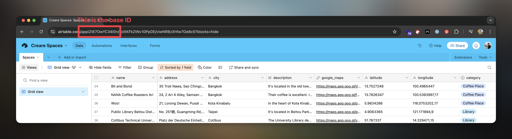
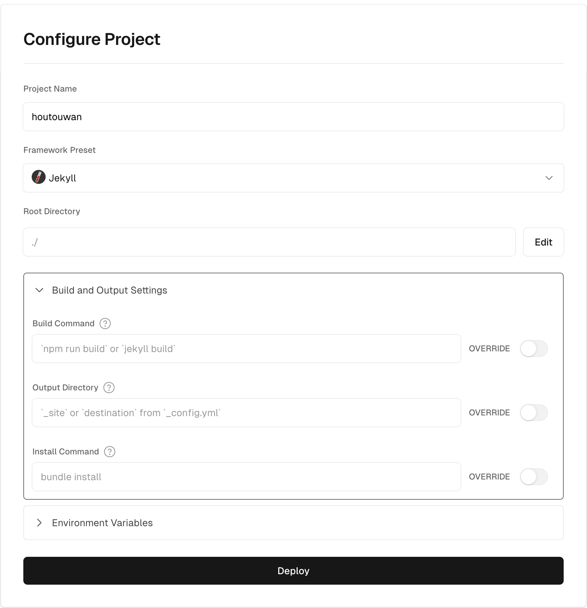

# Houtouwan

Project description

---

Several decades ago, a small Chinese town was abandoned.

Completely depopulated, nature gradually took over, reclaiming every inch of concrete and covering it with a green mantle.

As if human life and nature had fused into one.

We’re talking about Houtouwan, a village in the Shengsi Archipelago, east of Shanghai.

Houtouwan didn’t die, as many believe. It changed. It transformed. We’ve created this template to build crearespaces.com, where we gather places that inspire us.

You can use it to transform those lists you have into directories. A new life. A new perspective. And the goal of survival (and sharing).

---

## How to use it

### 1. Duplicate the Airtable Template

To begin, you'll need to duplicate the provided Airtable template. You can find the [template here](https://airtable.com/appszGRwxOuju9sYi/shrFBTjrS9u2BA78X). After duplicating it, customize the template by adding your specific places or data.

### Get the Airtable Token and Base ID

Once your Airtable base is set up, you need to obtain the Airtable Token and Base ID. These credentials allow your application to securely access the data in your Airtable base.

To get your Base ID, simply open the Airtable database and check the URL:



To get the Airtable token, you need to generate a personal access token. This can be done by visiting https://airtable.com/create/tokens and clicking on 'Create new token.' Then, you need to:

- Set a name for your token.
- Add a `data.records:read` in your scopes.
- Select your airtable base template.

After this, copy your token, and you are all set to start generating the places using the Airtable integration.

### 3. Clone this Repository

Next, clone the GitHub repository to your local machine. This repository contains the necessary files and configuration to build and deploy your project. Ensure you have a GitHub account and use the following command to clone the repository:

````
git clone https://github.com/albertogalca/houtouwan.git
````

### 4. Install Jekyll and npm/yarn

To build and manage your project, you'll need to install Jekyll ([follow the documentation](https://jekyllrb.com/docs/)), a static site generator, and npm ([follow the documentation](https://nodejs.org/en/download/package-manager)) for managin JavaScript packages.

### 5. Install dependencies

With Jekyll and npm installed, the next step is to install the project dependencies listed in the Gemfile and package.json files. Run the following commands in the root directory of your project:

````
bundle install
npm install
````

### 6. Configurate Vercel

You can deploy this template wherever you want. There are plenty of options, and most of them support Jekyll. In this case, to make it easier for you, I highly recommend Vercel because it's free. You can create an account on [Vercel](https://vercel.com/) and follow the instructions:

- Once you have created the account, you need to connect Vercel to GitHub. This way, we can select our new repository to be uploaded to Vercel.
- Once we have it, you just need to select "Import" in your project, and your configuration should look something like this (basically, you need to leave the default configuration). After that, click on "Deploy."



## Customization

1. How to customize texts
2. How to customize colors
3. How to customize fonts
4. SEO configurations
